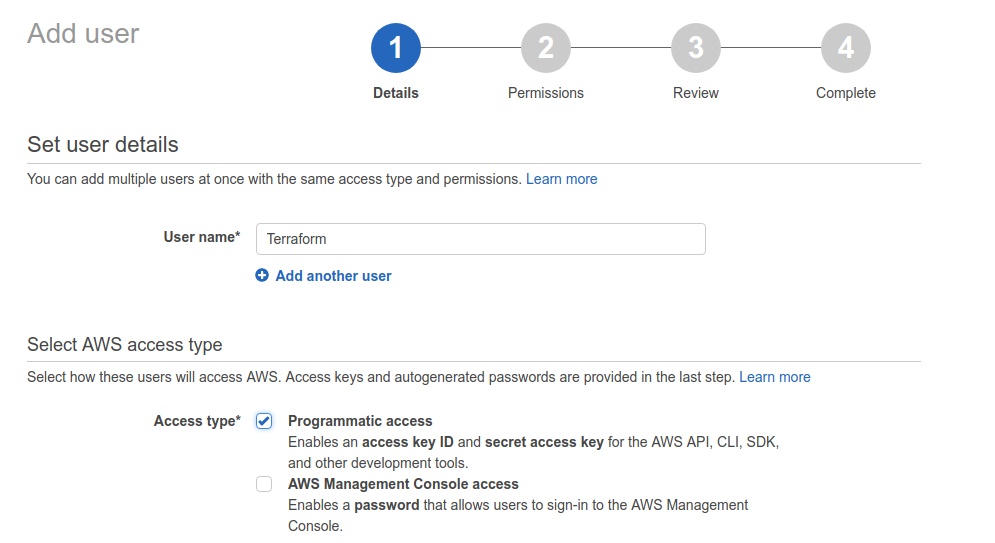
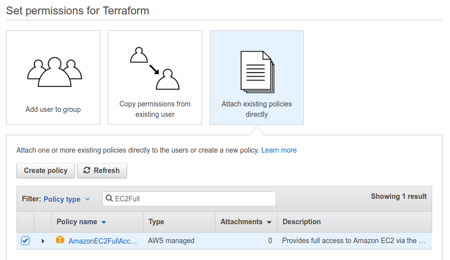

# Automating Netflix geoblocking

_DISCLAIMER: This has been written for educational purposes of learning about routing net traffic. I am not responsible for how you use this information. The title is clickbait only._

At the start of last year, I learnt how to launch a browser from another country, using Amazon Web Services (AWS) as a proxy service. 

At the start of this year, I also learnt of a great program called `terraform` (learn about it [here](https://www.terraform.io/intro/index.html), the docs are great!). `Terraform` makes it easy for anyone to use this service. All they need to do is sign up to AWS, create a _Role_ and _Access Key_ and they should be away.

This should work easily for Mac and linux users. Due to `terraform`, the process will be very similar for Windows users, but I have only provided helper `.sh` scripts.

## Plan

There steps we will take are

 - Download the `terraform` config files
 - Sign up to AWS
 - Make a User Role with an Access Key
 - Download and install `terraform`
 - Let `terraform` know our credentials
 - Automatically provision the proxy server
 - Launch `google-chrome` via the proxy server 

### Download the `terraform` config files

### Sign up to AWS

Sign up to AWS [here](https://portal.aws.amazon.com/billing/signup). If your first year of usage has already expired and you want to continue using free tier machines, create a new email address to sign up with first.

You will have to provide your payment card details. You will not be charged for the first year, using AWS only for the infrastructure in the provided `*.tf` file. Nonetheless **you do this at your own risk and I am not responsible** if you do get charged for something. Furthermore, if you do get charged, please let me know, as it might mean I'm getting charged, and that's not ideal.

### Make a User Role with an Access Key

 - The _User_ is an AWS abstraction. You can create a User to, in this case, allow programmatic access to AWS resources you specify. 
 - The _Access Key_ and _Secret Key_ are analogous to the username and password for the _User_.

Navigate to the _User Creation Page_ [here](https://console.aws.amazon.com/iam/home?region=us-east-1#/users). Note, that is not the page name. In case the page moves, it is found under `IAM > User`.

Create a `Terraform` User with programmatic access to enable access tokens.

 - Click the blue `Add User` button.  
 - Name the user `Terraform`
 - Tick `Programmatic access`
 - Click `Next`

You should have a result like the image below before moving to the next screen.

Next we give our `Terraform` user permission to manipulate servers on our AWS account, i.e., programs that can authorise as `Terraform` may create, destory, etc. provisioned virtual machines. 

 - Click `Attach existing policies directly`
 - Type `EC2Full` in the search bar
 - Tick the policy that returns from the search - `AmazonEC2FullAccess`
 - Click `Next`

 

 Review your selection to make sure programmatic access with full EC2 permission has been selected. Proceed to the next screen, where we will be presented with our newly created access tokens. You will be warned many times about these things

  - You can **only** see your _secret access key_ here
  - **Do not let anyone see your secret access key** - They can manipulate potentially expensive AWS resources with it

  Now the warnings are out the way

   - Copy your _Access key ID_ (AK) somewhere safe
   - Click `Show` under _Secret access key_
   - Copy your _Secret access key_ (SK) somewhere safe